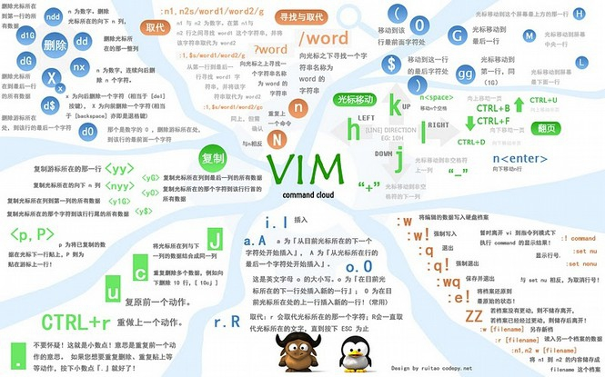
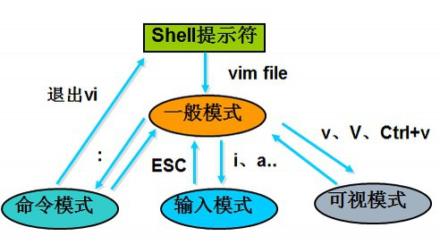
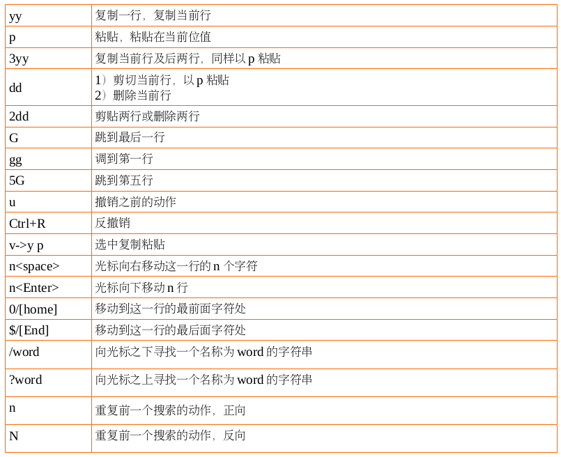
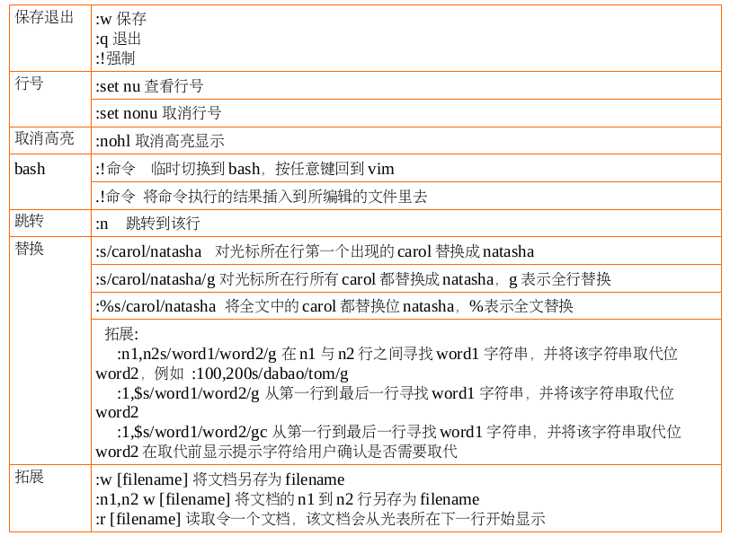
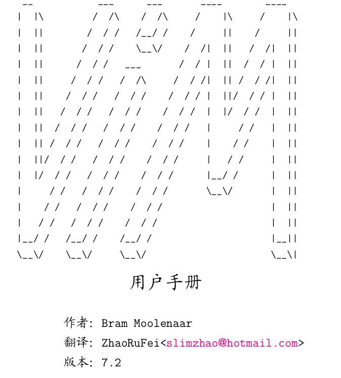
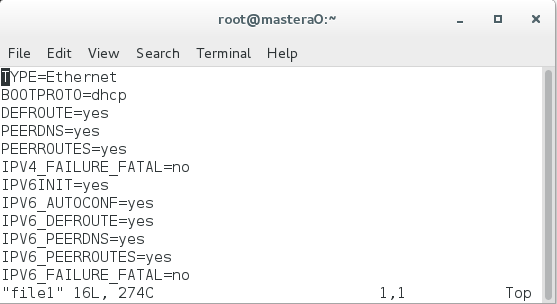
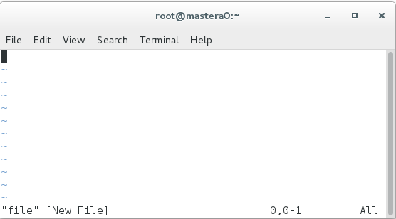
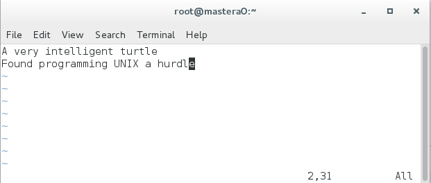
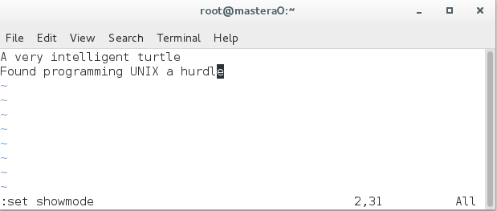

# Vim 编辑器
<!-- TOC depthFrom:1 depthTo:6 withLinks:1 updateOnSave:1 orderedList:0 -->

- [Vim 编辑器](#vim-编辑器)
	- [1 Vim 简介](#1-vim-简介)
		- [1.1 Vim - 难以驾驭的神器](#11-vim-难以驾驭的神器)
		- [1.2 Vim 入门帮助](#12-vim-入门帮助)
		- [2.1 Vim 模式介绍](#21-vim-模式介绍)
		- [2.2 正常模式](#22-正常模式)
		- [2.3 命令模式](#23-命令模式)
		- [2.4 插入模式](#24-插入模式)
	- [3 Vim 实例](#3-vim-实例)
		- [3.1 Vim 第一步](#31-vim-第一步)
			- [3.1.1 首次运行 Vim](#311-首次运行-vim)
			- [3.1.2 插入文本](#312-插入文本)
			- [2.1.3 移动光标](#213-移动光标)
			- [2.1.4 删除字符](#214-删除字符)
			- [2.1.6 其它编辑命令](#216-其它编辑命令)
			- [2.1.7 退出](#217-退出)
			- [3.2.1 光标的指定移动](#321-光标的指定移动)
			- [3.2.2 简单搜索](#322-简单搜索)
			- [3.2.3 复制粘贴](#323-复制粘贴)
			- [3.2.4 替换字符](#324-替换字符)
		- [3.3 Vim 的保护机制](#33-vim-的保护机制)
	- [作业](#作业)

<!-- /TOC -->
## 1 Vim 简介


Vim 是 Linux 系统上的最著名的文本/ 代码编辑器,也是早年的 Vi
编辑器的加强版,而 gVim 则是其 Windows 版。它的最大特色是完全
使用键盘命令进行编辑,脱离了鼠标操作虽然使得入门变得困难,但上
手之后键盘流的各种巧妙组合操作却能带来极为大幅的效率提升。
因此 Vim 和现代的编辑器(如 Sublime Text)有着非常巨大的差异,
而且入门学习曲线陡峭,需要记住很多按键组合和命令,如今被看作是
高手、Geek 们专用的编辑器。尽管 Vim 已经是古董级的软件,但还是
有无数新人迎着困难去学习使用,可见其经典与受欢迎程度。另外,由
于 Vim 的可配置性非常强,各种插件、语法高亮配色方案等多不胜数,
无论作为代码编辑器或是文稿撰写工具都非常给力 ......

在 Linux 系统中配置应用服务,实际上就是在修改它的配置文件(配置
文件可能有多个,其中包含不同的参数), 而且日常工作中也一定免不了
编写文档的事情吧, 这些都是要通过文本编辑器来完成的。
在热门 Linux 操作系统中都会默认安装一款超好用的文本编辑器 —— 名字叫 “ vim”,vim 是 vi 编辑器
的升级版。

### 1.1 Vim - 难以驾驭的神器

无论是小说中还是电视剧,一些真正强大的武器总不是那么容易驾驭的,主角总得付出一些努力才能收获到
更加强大的力量,对于 Vim 这种上古神器来说更是如此。由于它全程使用键盘操作,你必须记住一堆快捷
键、按键组合以及各种命令才能开始使用,很多首次接触 Vim 的人会觉得越学越复杂而中途放弃。然而,
坚持下来的朋友就会渐渐地发现这种键盘流操作的设计绝妙之处!经典之所以能成为经典,必然有它的道理,
我想我也不用解释太多~

如果你是一位 IT 界人士,需要或将要与 Linux 系统打交道,那么学习好 Vim 的操作绝对能让你的工作
轻松百倍!!因为很多时候, Linux 作为服务器是不会开启图形界面,当需要远程操作时,你只能利用
SSH“ 命令字符式 ” 的 Shell 界面对其进行操作,这时如果你需要修改服务器上的网页代码或配置文件,VI
或 VIM 命令就是你最佳最方便也是最强大的伙伴了!相信我,学好 数理化 VIM ,走遍天下也不怕 ......

### 1.2 Vim 入门帮助



下面首先对 Vim 做一下最基本的介绍,并给出一些参考信息,以方便对 Vim 不熟悉的读者也能够理解并自
己查阅进一步信息。

Vim 带有完整的帮助文档。

1. 进入 Vim 后输入 “ :help”即可访问
2. 新手在操作系统的命令行上输入 vimtutor 命令即可开始学习一个简单的 30 分钟的 Vim 教程2 Vim 命令

### 2.1 Vim 模式介绍



与大部分其它编辑器不同,进入 Vim 后,缺省状态下键入的字符并不会插入到所编辑的文件之中。Vim 的
模式(mode ,可以简单地理解为 “ 状态 ” )概念非常重要。需要知道,Vim 有以下几个模式:

* 正常(normal)模式,缺省的编辑模式;下面如果不加特殊说明,提到的命令都直接在正常模式下
输入;任何其它模式中都可以通过键盘上的 Esc 键回到正常模式。
* 命令(command)模式 ,用于执行较长、较复杂的命令;在正常模式下输入 “ :” (一般命令)、 “ /”
(正向搜索)或 “ ?”(反向搜索)即可进入该模式;命令模式下的命令要输入回车键(Enter)才算完成。
* 插入(insert)模式 ,输入文本时使用;在正常模式下键入 “ i”(insert )或 “ a”(append)即可
进入插入模式(也有另外一些命令,如 “ c”,也可以进入插入模式,但这些命令有其它的作用)。
* 可视(visual)模式 ,用于选定文本块;可以在正常模式下输入 “ v”(小写)来按字符选定,输入
“V” (大写)来按行选定,或输入 “ Ctrl-V”来按方块选定。
* 选择(select)模式 ,与普通的 Windows 编辑器较为接近的选择文本块的方式;在以可视模式和
选择模式之一选定文本块之后,可以使用 “ Ctrl-G” 切换到另一模式 —— 该模式很少在 Linux 上使用,本
文中就不再介绍了。

### 2.2 正常模式



### 2.3 命令模式



### 2.4 插入模式

* i 光标所在位置插入
* I 光标所在位置行首插入
* o 光标所在位置下方新开一行插入
* O 光标所在位置上方新开一行插入
* a 光标所在位置下一个字符的位置插入
* A 光标所在位置行行尾插入

## 3 Vim 实例

本实例作为基础教程,拓展部分见附录《Vim 用户手册中文版 7.2》



### 3.1 Vim 第一步

#### 3.1.1 首次运行 Vim

```shell
[root@mastera0 ~]# ll file1
-rw-r--r--. 1 root root 274 Jun 24 12:19 file1
[root@mastera0 ~]# vim file1
```

使 Vim 开始编辑一个名为 file1 的文件。屏幕上看起来大致是这样:
* "黑色块" 代表当前光标位置;
* 上波浪线(~)表示所在行并不是文件内容的一部分。换句话说,Vim 将 文件之外的部分显示为波浪线;
* 在窗口的底部, 一个消息行显示说当前正 在编辑的文件叫 file1,它有 16 行,274 个字符。但前光
标所在位置为第一行的第一位



如果是新文件呢?

```shell
[root@mastera0 ~]# vim file
```



在窗口的底部, 一个消息行显示说当前正 在编辑的文件叫 file,并且它是一个新文件。

#### 3.1.2 插入文本

Vim 编辑器是一个模式编辑器。这意味着在不同状态下编辑器有不同 的行为模式。两个基本的模式 Normal
模式和 Insert 模式。在 Normal 模式下你键入的每一个字符都被视为一个命令。而在 Insert 模式下键入
的字符 都作为实际要输入的文本内容。 刚启动时 Vim 工作于 Normal 模式。要进入 Insert 模式你需要使
用"i" 命 令(i 意为 Insert)。接下来就可以直接输入了。别怕出错, 错了还可以修 改。比如下面这首程序
员的打油诗:
```shell
A very intelligent turtle
Found programming UNIX a hurdle
```
"turtle" 之后你按下回车键另起一行。最后按下 <Esc> 键退出 Insert 模式 ,回到 Normal 模式。现在你的Vim 窗口中有了这样的两行内容 :



现在是什么模式?

要知道你现在所处的工作模式是什么,打开显示模式的开关:
```shell
:set showmode
:set noshowmode 关闭显示模式
```



你会看到按下冒号键之后当前光标跑到窗口的最后一行去了。那是使用冒 号命令的地方(顾名思义,冒号命
令就是总是以冒号打头的命令) 。最后按 下回车键结束整个命令(所有的冒号命令都以这种方式表明命令的
结束).

现在,如果你键入了"i"命令 Vim 就会在窗口底部显示--INSERT-- 。这 表明你目前处于 Insert 模式。
如 果 按 下<Esc> 键 返 回 到 Normal 模 式 刚 才 显 示 出 来 的 模 式"--INSERT-- 就会消失 ;Normal模式并不会显示 — NORMAL--,作为默认的工作模式它不显示任何字串。

Vim 新手最头痛的问题就是模式---经常忘记自己置身于何种模式, 或者不经意敲了哪个字符就切换到别的
模式去了。

不管你当前所处的模 式是什么,按下<Esc>都会让你回到 Normal 模式(即使已经在 Normal 模式 下)。有时
需要按两次<Esc>,如果 Vim 以一声蜂鸣回答你, 那说明你已经 是在 Normal 模式了。

#### 2.1.3 移动光标

回到 Normal 模式后 , 你就可以用下面的命令来移动光标 :
* h 左
* j 下
* k 上
* l 右

人们一开始会认为这些字符是随意选取的。毕竟有谁 l 来代 表 right 呢 ? 但事实上 , 这些字符都是精心挑选的 :

在编辑器中移动光 标是十分常用的操作 , 这些字符在键盘上都分布在你右手周围。这样的安 排可以使你最快
最方便地使用它们 ( 尤其是对那些用十个手指而不是二指 禅用户而言 ) 。

备注 : 同时你还可以用箭头键来移动光标。不过这样做实 际上会大大降低你的效率。因为用这些键你需要不
停地在 字母区和箭头键之间频繁转换。想象一下要是你在一小时 内这样做一百次会占用你多少时间 ? 另外 , 并
不是每个键 盘上都安排有箭头键 , 或者都把它们放在最常见的位置 ; 所以使用 hjkl 还是大有好处。

练习文件名位 hjkl ,放在共享当中。如果进入了插入模式不要忘了要用 <Esc> 回到 Normal 模 式。 |
vimtutor| 也是学习这些命令的一个好去处。

记住:学习这些命令的最好办法不是使用什么记忆法 , 而是练习。

#### 2.1.4 删除字符

要删除一个字符,只需要将光标移到该字符上按下"x". ( 这是在追 忆古老的打字机时代,在打字机上删除字
符就是用 xxxx 来覆盖它) 把光标 移到上面例子中的第一行,键入 xxxxxxx(7 个 x) 来删除"A very "。


输入其它内容
比如:首先键入的命令是 i( 进 入 Insert 模 式), 接着插入"A young", 然后 退 出 Insert 模式(最后的<Esc>)。

删除一行

删除一整行内容使用"dd"命令。删除后下面的行会移上来填补空缺:2.1.5 撤消与重做

撤销一次操作

如果你误删了过多的内容。显然你可以再输入一遍,但是命令"u" 更 简便, 它可以撤消上一次的操作 1 。
实际看一下它的效果,用"dd" 命令来 删除前面例子中的第一行内容,"u"命令会把它找回来。

重做
如果你撤消了多次,你还可以用 CTRL-R(重做) 来反转撤消的动作。换 句话说,它是对撤消的撤消。

撤销一行操作

撤消命令还有另一种形式,"U"命令, 它一次撤消对一行的全部操作。第 二次使用该命令则会撤消前一
个"U"的操作。

* 删除 very
* 删除 turtle
* 用"u"撤消"U"
* 用"U" 恢复该行

"U"命令本身也造成了一次改变,这种改变同样可以用"u" 命令 和 CTRL-R 来撤消和重做。看起来这很容易
把人搞糊涂,不过别担心, 用"u"和 CTRL-R 你可以找回任何一个操作状态。

#### 2.1.6 其它编辑命令

Vim 有一大堆命令来改变文本。这里仅列 出一些最常用的。

追加 a

"i" 命令可以在当前光标之前插入文本。但如果你想在当前行的末尾 添加一些内容时怎么办呢?你必需在光
标之后插入文本。答案是用"a" 命 令来代替"i"。

另起一行 o\O

1. "o"命令可以在当前行的下面另起一行,并使当前模式转为 Insert 模 式。这样你可以在该命令之后直接输
入内容。假设光标位于下面两行中第 一行的某处:
2. "O"命令(注意是大写的字母 O)将在当前行的上面另起一行。

使用命令计数

假设你要向上移动 9 行。这可以用"kkkkkkkkk"或"9k" 来完成。事实 上,很多命令都可以接受一个数字作
为重复执行同一命令的次数。比如刚 才的例子,要在行尾追加三个感叹号,当时用的命令是"a!!!<Esc>"。
另 一个办法是用"3a!<Esc>"命令。

3 说明该命令将被重复执行 3 次。同样, 删 除 3 个字符可以用"3x"。指
定的数字要紧挨在它所要修饰的命令前面。

#### 2.1.7 退出

要退出 Vim,用命令"ZZ"。该命令保存当前文件并退出 Vim.

放弃编辑 :q!

有时你会在做了一连串修改之后突然意识到最好是放弃所有的修改重 新来过。别担心。Vim 中有一个命令可
以丢弃所有的修改并退出:
:q!
别忘了在命令之后加回车。

放弃编辑并重新载入 :e!

如果你在放弃所有修改后还想以该文件的初始内容作为开始继续编 辑,还可以用":e!"命令放弃所有修改并
重新载入该文件的原始内容。

保存并退出:wq :wq!

一般我们都是需要保存并退出的,有一些文件保存的时候需要强制保存退出,这时加上!即可。比
如/etc/shadow2.1.8 求助

你想做的任何操作都可以在 Vim 的帮助文件里找到答案, 别怕问问 题!
:help

会带你到帮助文件的起始点。

如果你没有指定一个具体的帮助主题,":help" 命令会显示上面提到 的帮助文件的起点。Vim 的作者聪明地
(也许是懒惰地) 设计了它的帮助系 统: 帮助窗口也是一个普通的编辑窗口。你可以使用跟编辑其它文件时一
样的命令来操作帮助文件。比如用 hljk 移动光标。

退出帮助窗口也跟退出其它文件编辑窗口一样,使用"ZZ" 即可。这只 会关闭帮助窗口,而不是退出 Vim.
浏览帮助文件时,你会注意到有一些内容用两个小栅栏围了起来( 比 如|help|)。这表明此处是一个超链接。
如果你把光标置于两个小栅栏之间的任何位置然后按下 CTRL-](跳转到一个标签的命令),帮助系统就会带
你 到那个指定的主题。(因为一些此处不便讨论的原因,在 Vim 的术语中这种 超链接叫标签。所以 CTRL-]
可以跳转到当前光标之下的那个 word 所对应的 链接中 1 。

几次跳转之后,你可能想回到原来的某个地方,CTRL-T(弹出标签) 可 以回到前一个位置。用命令 CTRL-
O(跳转到较早的位置) 也可以。 帮助窗口的开始有一个关于*help.txt*的说明。在星号"*" 之间的字 符被
帮助系统定义为一个标签的目的地(超链接的目的地).

要查看关于某个特殊主题的帮助,使用下面的命令形式:
`:help {subject}`

例如,查看关于 showmode 的帮助
`:help showmode3.2 改动`


#### 3.2.1 光标的指定移动

"G"命令 指定一 个命令计数, 这个命令就会把光标定位到由命令计数指定的行上。比 如"33G"就会把光标
置于第 33 行上。

```shell
[root@mastera0 ~]# cp /var/log/messages messages
[root@mastera0 ~]# vim messages
```

没有指定命令计数作为参数的话 :
* "G" 会 把 光 标 定 位 到 最 后 一 行 上
* "gg"命令是跳转到第一行的快捷的方法。"1G"效果也是一样, 但是敲 起来就没那么顺手了。
* "%"命令 另一个移动到某行的方法是在命令"%" 之前指定一个命令计数 。 如"50%"将会把光标定位在文件的中间;比"90%" 跳到接文件尾的地 方 。

#### 3.2.2 简单搜索

"/string"命令

"/string"命令可用于搜索一个字符串。比如要找到单词"mysql", 使用命令:
`/mysql`

要查找上次查找的字符串的下一个位置。使用"n" 命令。如果你知 道你要找的确切位置是目标字符串的第几
次出现,还可以在"n" 之前放置 一个命令计数。"3n"会去查找目标字符串的第 3 次出现。向光标所在位置以
上查找用"N"。

"?string"命令

"?"命令与"/"的工作相同,只是搜索方向相反。比如要找到单词"mysql", 使用命令:
`?mysql忽略大小写`

通常情况下你要准确地键入你要查找的东西。如果你并不关心目标字 符中字母的大小写,可以通过设
置'ignorecase'选项:
`:set ignorecase`

取消则设置'noignorecase'选项:
`:set noignorecase`

如果你在编辑一段源程序时看到了一个叫"nr" 的变量。你想查看一 下这个变量就被用在了哪些地方。简单
的办法是把光标移到"nr" 上然后 用"*" 命令和"n" 命令一个一个地查找所有的匹配。
不过还有更好的办法。使用下面的命令:
`:set hlsearch`

现在你要再查找"nr", Vim 就会以某种形式高亮显示所有符合的匹配。对 于想查看一个变量被用在哪些地
方,这个办法太棒了, 不需任何其它的命 令 看得眼花的时候还可以关闭这一功能:
`:set nohlsearch`

不过你要在下次搜索时再次使用这一功能就又得打开它。如果你只是想去 掉当前的高亮显示,可以使用下面
的命令 :
`:nohlsearch`

#### 3.2.3 复制粘贴

要把文本内容从一处复制到另一处
1. 先删除 dd 再粘贴 p
2. "y" 操作符命令会把文本复制到一个寄存器 中。然后可以用"p"命令把它取回。

"y"命令
* "yw"来复制一个 word;
* "y2w"命令复制两个 word;
* "yy"复制一行;
* "3yy"复制光标所在行和向下的行,一共三行;

例如:
1. 复制 file 文件中的 turtle 并粘贴到该行的最后;
2. 复制 file 文件中的 intelligent turtle 并粘贴到该行的最后;
3. 复制 file 文件中的第二行并粘贴到第四行;
4. 复制 file 文件中的第一行第二行第三行,并粘贴到第五行第六行第七行。

#### 3.2.4 替换字符

* :s/UNIX/linux 对光标所在行第一个出现的 UNIX 替换成 linux
* :s/UNIX/linux /g 对光标所在行所有 UNIX 都替换成 linux , g 表示全行替换
* :% s/UNIX/linux /g 将全文中的 carol 都替换位 natasha , "%" 指定该命令将作用于所有行上

### 3.3 Vim 的保护机制

如果我们没有通过 q 退出,而是通过其他方式强行退出,比如说直接关终端,会导致 vim 的一个报错,当我
们下次打开这个文件的时候,会提示
`Found a swap file by the name ".file.swp"`

这是因为 vim 他不是实时写入的机制,他会先把文件写到内存,等我们执行 w 操作以后,再写回到原文件。
那么在写回原文件,或者执行 q 的放弃操作之前,会生成一个临时的文件,以 . 开头, swp 结尾。当我们看
到这种情况,就说明这个文件是在变编辑的过程中强制退出的,或者是正在被人编辑。

所以这个文件的作用就是防止强制退出造成的数据安全隐患,和防止文件同时被多次修改。
```shell
Swap file ".file.swp" already exists!
[O]pen Read-Only, (E)dit anyway, (R)ecover, (D)elete it, (Q)uit, (A)bort:
```

我们可以根据他的提示执行相应的操作,比如说 Q ,退出。如果想要顺利编辑这个文件的话,一方面可以使
用 E ,无论如何也要编辑,或者先退出,把 swp 文件删除了以后再编辑,也是可以的。

注意:要使用 vim 需要注意一下权限问题,必须要有读写权限才能使用 vim 。

可以看一下没有写权限和没有读权限会出现什么问题。

## 作业

1. 复制eth0的配置文件位/tmp/test
`cp /etc/sysconfig/network-scripts/ifcfg-eth0 /tmp/test`
2. 使用vim编辑该文件，练习不同模式的切换，尤其是正常变插入模式的几种用法；
3. 练习保存的几种命令，包括保存退出，不保存退出。
4. vim练习游戏
	vim-adventures.com
	vim大冒险

没有写权限,进入到插入模式时候回报错。没有读权限,在打开 vim 的同时就会报错。
