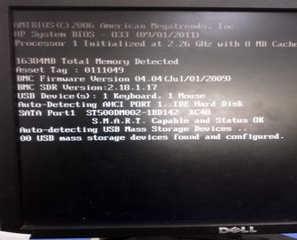
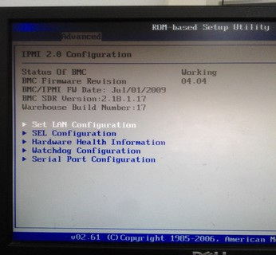
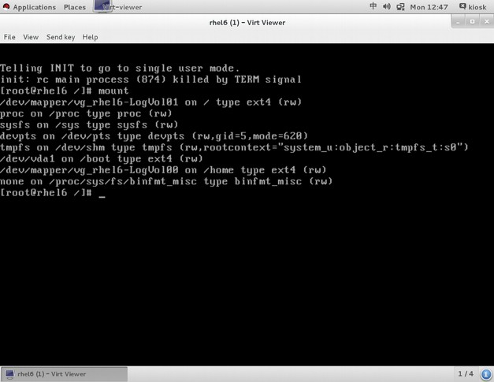
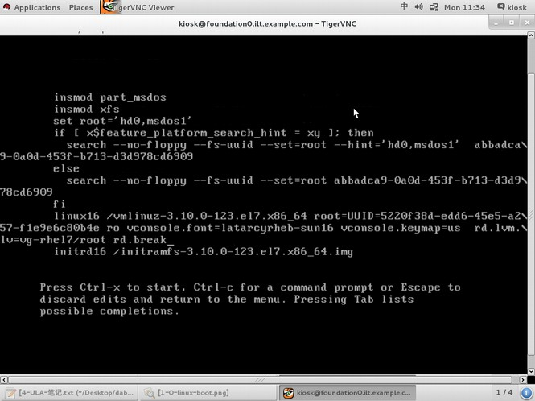

# Linux 开机启动流程


- [Linux 开机启动流程](#linux-开机启动流程)
	- [1 启动流程概览](#1-启动流程概览)
	- [2 详细讲解](#2-详细讲解)
		- [2.1 开机软件 —— BIOS、Grub](#21-开机软件-biosgrub)
			- [2.1.1 名词解释](#211-名词解释)
			- [2.1.2 流程解释](#212-流程解释)
			- [2.1.3 BIOS](#213-bios)
		- [2.2 开机文档 —— menu.lst、grub.conf](#22-开机文档-menulstgrubconf)
			- [2.2.1 Grub 配置文档](#221-grub-配置文档)
			- [2.2.2 流程解释](#222-流程解释)
			- [2.3.1 流程解释](#231-流程解释)
			- [2.3.2 init 执行的相关文件](#232-init-执行的相关文件)
	- [3 实验](#3-实验)
		- [3.1 rhel6 单用户模式修改密码](#31-rhel6-单用户模式修改密码)
		- [3.2 rhel7 单用户模式修改密码](#32-rhel7-单用户模式修改密码)
	- [4 作业](#4-作业)


## 1 启动流程概览

1. 加载 BIOS 的硬件信息并自我测试 , 依据设定取得第一个可开机的装置 ;
2. 读取并执行第一个开机装置内 MBR 的 boot Loader ( grub, spfdisk 等程序 );
3. 依据 boot loader 的设定加载 Kernel
4. Kernel 会开始侦测硬件并加载驱动程序 ;
5. 在硬件驱动成功后 ,Kernel 会主动呼叫 init 程序
6. init 会取得 run-level 信息 ;
7. init 执行 /etc/rc.d/rc.sysinit 档案来准备软件执行的作业环境 ( 如网络、时区等 );
8. init 执行 run-level 的各个服务的启动 (script 方式 );
9. init 执行 /etc/rc.d/rc.local 档案 ;
10. init 执行终端仿真程序 mingetty 来启动 login 程序 ,
11. 最后等待用户登入

## 2 详细讲解

### 2.1 开机软件 —— BIOS、Grub


#### 2.1.1 名词解释

1. BIOS 一个写入到主板上的一个软件程序,在开机的时候,计算机系统会主动执行第一个程序
2. HD 硬盘
3. MBR 主要启动记录区(Master Boot Record)该硬盘里的第一个扇区 512 bytes
4. boot loader 开机管理程序,可读取核心文件并执行 446 bytes
5. DPT 磁盘分割表(disk partition table)记录整颗硬盘分割状态 64 bytes
6. 55AA 2 bytes

#### 2.1.2 流程解释

* 通电后,服务器主版上的一个软件 BIOS 启动,他的任务就是找到带有开机程序的设备,此处以硬盘
为例, BIOS 的任务结束;
* 该硬盘上的第一个扇区中有一个开机管理程序, rhel6 上为 grub1 , rhel7 上为 grub2 ,版本不同;
* 接下去就是 grub 在工作了。

#### 2.1.3 BIOS

*开机时按下 pause break 暂停中断,可以看到 bios 的大概信息:*



AMIBIOS(C)2006 American Megatrends, Inc.

基本输入输出系统的版本为 AMIBIOS ,为美国趋势科技

2006 年生产

HP System BIOS – 033 (09/01/2011)

惠普系统的基本输入输出系统,支持到 2011/01/09 的硬件

Processor 1 Initiallized at 2.26 GHz with 8 MB cache

处理器 cpu 一个,频率为 2.26GHz , 8M 缓冲

16384MB Total Memory Detected

16G 内存

Asset Tag : 0111049

资产编号为 0111049

BMC Firmware Version 04.04(Jul/01/2009)

BMC SDR Version : 2.18.1.17

basebiard management controller 底板管理控制器的缩写,时一个在 IPMI 结构下提供智能管理的控制器

IPMI 时智能平台管理界面,即与 intel 结构的企业系统中所使用外围设备采用的一种工业标准。

USB Device(s) : 1 Keyboard , 1 Mouse

usb 设备有一个鼠标一个键盘,此处可以查看是否有人恶意用 usb 设备要攻击服务器

Auto-Detecting AHCI PORT 1 .. IDE Hard Disk 自动检测

*开机按下 F10 ,进入 BIOS 管理界面*




*IPMI*

HP 服务器远程管理平台


### 2.2 开机文档 —— menu.lst、grub.conf

#### 2.2.1 Grub 配置文档

* menu.lst
* grub.conf

```shell
[root@rhel6 grub]# ll /boot/grub/
total 274
-rw-r--r--. 1 root root 63 Jul 2 2015 device.map
-rw-r--r--. 1 root root 13380 Jul 2 2015 e2fs_stage1_5
-rw-r--r--. 1 root root 12620 Jul 2 2015 fat_stage1_5
-rw-r--r--. 1 root root 11748 Jul 2 2015 ffs_stage1_5
-rw-------. 1 root root 796 Jul 2 2015 grub.conf
-rw-r--r--. 1 root root 11756 Jul 2 2015 iso9660_stage1_5
-rw-r--r--. 1 root root 13268 Jul 2 2015 jfs_stage1_5
lrwxrwxrwx. 1 root root 11 Jul 2 2015 menu.lst -> ./grub.conf
-rw-r--r--. 1 root root 11956 Jul 2 2015 minix_stage1_5
-rw-r--r--. 1 root root 14412 Jul 2 2015 reiserfs_stage1_5
-rw-r--r--. 1 root root 1341 May 7 2010 splash.xpm.gz
-rw-r--r--. 1 root root 512 Jul 2 2015 stage1
-rw-r--r--. 1 root root 126100 Jul 2 2015 stage2
-rw-r--r--. 1 root root 12024 Jul 2 2015 ufs2_stage1_5
-rw-r--r--. 1 root root 11364 Jul 2 2015 vstafs_stage1_5
-rw-r--r--. 1 root root 13964 Jul 2 2015 xfs_stage1_5
[root@rhel6 grub]# vim grub.conf
default=0
timeout=5
splashimage=(hd0,0)/grub/splash.xpm.gz
hiddenmenu
title Red Hat Enterprise Linux (2.6.32-431.el6.x86_64)
开机启动的系统名称,指定启动硬盘位置在第一个硬盘的第一个分区
root (hd0,0)
指定核心文件的名称及位置 /boot/ ,指定语言等等
kernel /vmlinuz-2.6.32-431.el6.x86_64 ro root=/dev/mapper/vg_rhel6-LogVol01 rd_NO_LUKS
LANG=en_US.UTF-8 rd_NO_MD SYSFONT=latarcyrheb-sun16 KEYBOARDTYPE=pc
KEYTABLE=us rd_LVM_LV=vg_rhel6/LogVol01 rd_NO_DM rhgb quiet
指定核心加载的模块文件 /boot/
initrd /initramfs-2.6.32-431.el6.x86_64.img
```

#### 2.2.2 流程解释

* grub 软件的任务就是找到核心文件,并加载该文件
* 内核的第一任务就是驱动硬件
* 内核第二任务就是呼叫 init 程序,接下来就交给 init 了2.3 init 程序

#### 2.3.1 流程解释

- init 程序挂接 /etc 和 /lib 所在的目录分区
- 执行 /etc/inittab 文件,取得 run-level 信息,判断是否开启终端、网络等
- 执行 /etc/rc.d/rc.sysinit 初始化环境 ( 如网络、时区等 )
- 执行 run-level 的各个服务的启动 (script 方式 );
- 执行 /etc/rc.d/rc.local 档案
- 执行终端仿真程序 mingetty 来启动 login 程序,最后等待用户登入


#### 2.3.2 init 执行的相关文件

```shell
[root@rhel6 ~]# cat /etc/inittab
# Default runlevel. The runlevels used are:
# 0 - halt (Do NOT set initdefault to this)
# 1 - Single user mode
# 2 - Multiuser, without NFS (The same as 3, if you do not have networking)
# 3 - Full multiuser mode
# 4 - unused
# 5 - X11
# 6 - reboot (Do NOT set initdefault to this)
#
id:5:initdefault:
[root@rhel6 etc]# ll /etc/rc.d
total 60
drwxr-xr-x. 2 root root 4096 Jul 2 2015 init.d
-rwxr-xr-x. 1 root root 2617 Oct 10 2013 rc
drwxr-xr-x. 2 root root 4096 Jul 2 2015 rc0.d
drwxr-xr-x. 2 root root 4096 Jul 2 2015 rc1.d
drwxr-xr-x. 2 root root 4096 Jul 2 2015 rc2.d
drwxr-xr-x. 2 root root 4096 Jul 2 2015 rc3.d
drwxr-xr-x. 2 root root 4096 Jul 2 2015 rc4.d
drwxr-xr-x. 2 root root 4096 Jul 2 2015 rc5.d
drwxr-xr-x. 2 root root 4096 Jul 2 2015 rc6.d
-rwxr-xr-x. 1 root root 220 Oct 10 2013 rc.local
-rwxr-xr-x. 1 root root 19432 Oct 10 2013 rc.sysinit
```

备注:以上分析均为 rhel6 操作系统, rhel7 启动改为 systemd 模式,相关文件
在 /usr/lib/systemd/system/*

## 3 实验

### 3.1 rhel6 单用户模式修改密码

- 1> 进入到数及时界面时,按上下键进入以下界面,选择 kernel 一行,按下 e 进行编辑
- 2> 在最后追加 1 或者 single 后,按下 esc3> 再按下 b ,启动后,进入单人模式后,输入 passwd 进行密码修改,修改完成后, reboot 即可。





### 3.2 rhel7 单用户模式修改密码

- 1> 进入如下界面后按 e 进入编辑模式
- 2> 找到 linux16 开始的那一行,删除没用的,在最后追加 rd.break ,然后按 Ctrl-x 重启即可进入单人模式
- 3> 进入单人模式后,用 mount 命令查看一下,会发现根目录时只读模式,因此需要重新挂载为读写模式

```shell
mount -o remount,rw /sysroot
chroot /sysroot
passwd
touch /.autorelabel ===>autorelabel 自动重新标记, selinux
exit
exit
```





## 4 作业

1. 名词解释

BIOS

MBR

boot loader

grub

DPT

55AA

2. 请自己描述 linux 开机启动的流程,并画出流程图。
3. linux 破解 root 密码
